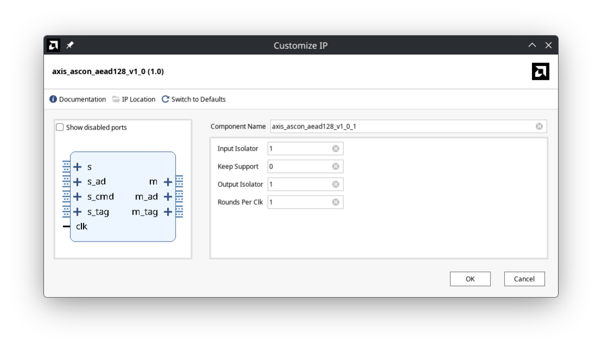

Ascon Cipher Verilog Implementation
===================================

A Verilog implementation of the Ascon AEAD 128a cipher as implemented in
[ascon-c](https://github.com/ascon/ascon-c).

Features:

* high performance fully pipelined implementation with excellent timing
  behavior
* the number of rounds per clock of the Ascon-p primitives can be specified
  through a generic and thus be optimally adjusted for the user's use case
  (timing vs area) (= configurable unroll factor)
* optional keep support (with arbitrary (except that it must be a power of two)
  byte width in the base engine -> saves area, in case you can do with larger
  alignment)
* packaged as a ready-to-use IP core for Vivado block design with AXIS MASTER
  and SLAVE interfaces
* released under a permissive BSD license (in hopes that it is actually used,
  now that ASCON got publicity after the standardization :) )
* full formal regression testbench with known answer tests (KATs)

TLDR
----

Building the IP Core:

```
cd ip_package; make
```

The Vivado IP can then be found in `ip_repo`. It looks like this:



Generating the full formal regression testbench:

```
cd src; make
```

Running the full formal regression testbench:

```
cd formal_gen; make -j $(nproc)
```

(Note though, that even on a modern 32 thread machine, this takes a few hours to complete.)

Running the self-test formal regression testbench:

```
cd formal; sby -f axis_ascon_aead128_selftest.sby bmc
```

However, this never really gets very far, because state space explodes.

In the `sim` directory, a standard Icarus Verilog self-checking testbench can
be found.

```
cd sim/axis_ascon_aead128; make
```

You can set the parameter `debug_trace` in the testbench, if you'd like to see
some traces.

Base Engine Description
-----------------------

The base engine is centered around a central input and output stream. Its
workings are documented in the top comments in the file
`rtl/ascon_aead128_core.v`.

IP Core Description
-------------------

The IP Core interfaces are, as is apparent from the image, centered around four
input SLAVE streams and three output MASTER streams. Before we dive into their
description, here is an explanation of the parameters:

* `input_isolator`: This setting enable an isolator at the input of the
  Core. This will significantly improve timing inside a larger design.
* `output_isolator`: This setting enable an isolator at the output of the
  Core. This will significantly improve timing inside a larger design.
* `rounds_per_clk`: This setting specifies the unroll factor, i.e. the number
  of rounds to be performed per clock cycle. There are no restrictions around
  this parameter, except that it must not be 0 or larger than 12. (Well, it
  _can_ be larger than 12, but that makes no sense; it must not be larger than
  16 in fact.)
* `keep_support`: This is self explanatory. Effects the input and output TKEEP
  signals. If zero, they are ignored and tied off on the output side.

So here's the theory of operation, if you use it in a block design: First you
must send the core a command beat, where command is composed as follows:

* `s_cmd_tdata[127:0]` maps to the cipher key.
* `s_cmd_tdata[255:128]` maps to the cipher nonce.
* `s_cmd_tdata[256]` a one indicates to perform an encryption operation, a zero is a decryption operation.
* `s_cmd_tdata[257]` a one indicates that associated data will be presented.
* `s_cmd_tdata[258]` a one indicates that plaintext / ciphertext will be presented on the main stream.

You then need to send the packets you have indicated through the `s_ad` AXIS
SLAVE interface (associated data) and afterwards the plaintext / ciphertext
through the `s` (= main interface) SLAVE stream. The core will then simply
forward the associated data on the `m_ad` output AXIS MASTER stream. This is
intentional, as this core is dedicated for packet processing applications,
where the associated data may be the header and contains routing information
(and if you don't need it, simply throw it away). The main output MASTER
interface (`m`) contains the encrypted data. Be aware though, that the tag is
_not_ appended to this data. Inserting that data in the ciphertext with byte
support is rather complicated, and I figured, if you use this with a DMA, let
the DMA handle the unalignment. After the ciphertext, the tag is then presented
on the tag MASTER stream.

For the decryption operation the core operates in a similar manner, except that
it also expects a SLAVE tag input beat after the associated data and the
ciphertext (if they're present, otherwise right after the command beat). The
core will now also output a tag beat as in encryption operation, but this tag
is zero in case of a successful tag match, and has any other value otherwise.
User logic needs to do the buffering and make sure not to forward such a
packet.

(IMPORTANT NOTE: Unless the input isolator is activated, this core is not
compliant with the AXIS specification on the input streams, because the core
will only raise its READY signals, if a VALID signal is provided (except for
the command stream). This is due to the inner working of the base engine and
cannot be changed due to input / output stream interlock. This might be an
issue, so remember this if you use the core in a larger design.)

Verification Strategies
-----------------------

The formal verification testbench is generated from the KAT testvectors in the
file `assets/LWC_AEAD_KAT_128_128.txt`. Besides a bound model check, cover
checks are also run for state reachability. Running all 1089 testcases requires
a few hours even on a modern machine.

Resource Usage and Timing
-------------------------

Timing is quite good, here's a result for a `xczu7eg-fbvb900-3-e` Zynq
Ultrascale+ device with a target frequency of 400 MHz:

```
Slack (MET) :             0.802ns  (required time - arrival time)
  Source:                 ascon_aead128_core_inst/r_ad_reg_rep/C
                            (rising edge-triggered cell FDRE clocked by clock  {rise@0.000ns fall@1.250ns period=2.500ns})
  Destination:            ascon_aead128_core_inst/ascon_p_inst/r_state_reg[192]/D
                            (rising edge-triggered cell FDRE clocked by clock  {rise@0.000ns fall@1.250ns period=2.500ns})
  Path Group:             clock
  Path Type:              Setup (Max at Slow Process Corner)
  Requirement:            2.500ns  (clock rise@2.500ns - clock rise@0.000ns)
  Data Path Delay:        1.679ns  (logic 0.309ns (18.404%)  route 1.370ns (81.596%))
  Logic Levels:           6  (LUT2=1 LUT3=1 LUT6=4)
```

```
+-------------------------------+--------------------+------------+------------+---------+------+-----+--------+--------+------+------------+
|            Instance           |       Module       | Total LUTs | Logic LUTs | LUTRAMs | SRLs | FFs | RAMB36 | RAMB18 | URAM | DSP Blocks |
+-------------------------------+--------------------+------------+------------+---------+------+-----+--------+--------+------+------------+
| ascon_aead128                 |              (top) |       1390 |       1390 |       0 |    0 | 470 |      0 |      0 |    0 |          0 |
|   ascon_aead128_core_inst     | ascon_aead128_core |       1284 |       1284 |       0 |    0 | 463 |      0 |      0 |    0 |          0 |
|     (ascon_aead128_core_inst) | ascon_aead128_core |          4 |          4 |       0 |    0 | 138 |      0 |      0 |    0 |          0 |
|     ascon_p_inst              |            ascon_p |       1280 |       1280 |       0 |    0 | 325 |      0 |      0 |    0 |          0 |
|   ascon_pad_inst              |          ascon_pad |        106 |        106 |       0 |    0 |   7 |      0 |      0 |    0 |          0 |
+-------------------------------+--------------------+------------+------------+---------+------+-----+--------+--------+------+------------+
```

Oh boy, and now look at that logic level distribution :D

```
+-----------------+-------------+---+---+-----+-----+
| End Point Clock | Requirement | 1 | 4 |  5  |  6  |
+-----------------+-------------+---+---+-----+-----+
| clock           | 2.500ns     | 2 | 4 | 582 | 208 |
+-----------------+-------------+---+---+-----+-----+
```

I must admit, that I removed byte-support for this result and set the unroll
factor to 1, such that it looks good when compared to other implementations.
[Here](https://cryptography.gmu.edu/athenadb/fpga_auth_cipher/table_view)'s a
database, if you're interested. (You need to scroll down, on the bottom left is
a small search window, type `ascon` there, so you only see the ascon ciphers.)

Here's the data for four rounds per clock and full byte support:

```
+-------------------------------+--------------------+------------+------------+---------+------+-----+--------+--------+------+------------+
|            Instance           |       Module       | Total LUTs | Logic LUTs | LUTRAMs | SRLs | FFs | RAMB36 | RAMB18 | URAM | DSP Blocks |
+-------------------------------+--------------------+------------+------------+---------+------+-----+--------+--------+------+------------+
| ascon_aead128                 |              (top) |       4043 |       4043 |       0 |    0 | 471 |      0 |      0 |    0 |          0 |
|   ascon_aead128_core_inst     | ascon_aead128_core |       3840 |       3840 |       0 |    0 | 464 |      0 |      0 |    0 |          0 |
|     (ascon_aead128_core_inst) | ascon_aead128_core |          0 |          0 |       0 |    0 | 139 |      0 |      0 |    0 |          0 |
|     ascon_p_inst              |            ascon_p |       3840 |       3840 |       0 |    0 | 325 |      0 |      0 |    0 |          0 |
|   ascon_pad_inst              |          ascon_pad |        203 |        203 |       0 |    0 |   7 |      0 |      0 |    0 |          0 |
+-------------------------------+--------------------+------------+------------+---------+------+-----+--------+--------+------+------------+

Slack (MET) :             0.061ns  (required time - arrival time)
  Source:                 ascon_pad_inst/r_p_reg/C
                            (rising edge-triggered cell FDRE clocked by clock  {rise@0.000ns fall@1.250ns period=2.500ns})
  Destination:            ascon_aead128_core_inst/ascon_p_inst/r_state_reg[193]/D
                            (rising edge-triggered cell FDRE clocked by clock  {rise@0.000ns fall@1.250ns period=2.500ns})
  Path Group:             clock
  Path Type:              Setup (Max at Slow Process Corner)
  Requirement:            2.500ns  (clock rise@2.500ns - clock rise@0.000ns)
  Data Path Delay:        2.420ns  (logic 0.463ns (19.132%)  route 1.957ns (80.868%))

+-----------------+-------------+---+---+-----+-----+----+-----+
| End Point Clock | Requirement | 1 | 5 |  6  |  7  |  8 |  9  |
+-----------------+-------------+---+---+-----+-----+----+-----+
| clock           | 2.500ns     | 2 | 4 | 325 | 133 | 13 | 320 |
+-----------------+-------------+---+---+-----+-----+----+-----+
```

Performance
-----------

I don't have any performance data to show, but I have no doubt to assure you
that it is as optimized as can be without sacrificing timing. If you use this
core and run performance measurements, I will gladly put them here.

Here is a rough performance estimation. First we introduce the following variables:

* `l_a`: length of the associated data in bits
* `l_p`: length of the plaintext / ciphertext in bits
* `r`: rounds per clk parameter
* `pad_a()`: padding function for associated data, returns new length in bits
* `pad_p()`: padding function for plaintext / ciphertext, returns new length in bits

The number of clock cycles needed can the be calculated for a packet as such:

`n_clks = ceil(12/r) + ceil((pad_a(l_a)/128))*ceil(8/r) + ceil(pad_p(l_p)/128)*ceil(8/r) + ceil(12/r) + 1`

The first term is the number of cycles for key setup, the second and third term
the number of cycles for associated data and plaintext (/ ciphertext)
respectively, the fourth term is the processing of the tag and the last is that
one pause cycle between back to back packets (optimizing that case really
degrades timing, so I didn't do it).

The time required for one packet is then `T = n_clks/freq`, where `freq` is the
frequency of the core. The performance can then be calculated as `P = L/T`,
where `L = l_a + l_p`.

As an example, let's assume we're dealing with Ethernet packets of maximum
length ~ 1500 Bytes and our core is configured with an unroll factor of 1. For
nice alignment, let's make it 1440 Bytes / 11520 bits / 90 words. We thus
require 734 cycles if we only have plaintetxt and no associated data, which
results in a time span of 1835 ns with a clock frequency of 400 MHz. This
gives a performance of 6.278 Gbits/s.

TODO
----

Currently we only implement one candidate of the ASCON AEAD family. The other
variants as well as the hash functions are on my radar, let's hope I find the
time. Also a sample implementation on a development board would be nice.

Additional Notes
----------------

If you use this core, either on an FPGA or in an ASIC, please let me know,
because that would make me very happy! Also, if it's ok for you, I will
maintain a list here and put you on it!

FAQ
---

* Do I plan on supporting the CEASAR HARDWARE API?

No. Using that API, it is quite hard to design a core that is robust and
doesn't lock up on invalid input. But that's just my opinion.

Acknowledgements
----------------

I'd like to thank the author of [ascon-c](https://github.com/ascon/ascon-c) for
his reference implementation, which greatly simplified early debugging work.
